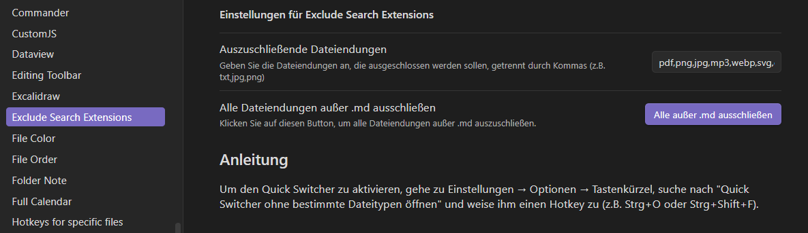
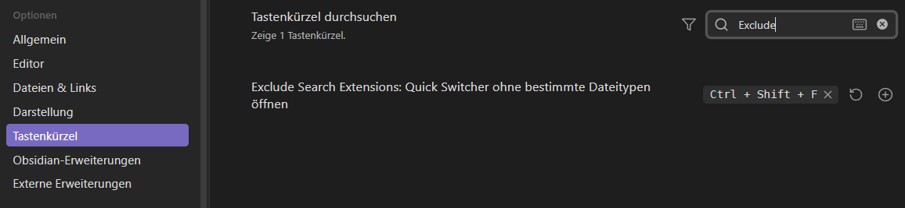

# obsidian-exclude-search

Obsidian Plugin to exclude certain file types from search results in Quick Switcher

## Plugin Settings

Gib in den Einstellungen des Plugins die Dateiendungen an, die ausgeschlossen werden sollen, z.B. txt,jpg,png



Du kannst dort auch mit einem Klick alle möglichen Dateiendungen ausschließen:
	```pdf,png,jpg,mp3,webp,svg,cmd,csv,mpd,gif,djvu,url,wav,lnk,m3u,sheet,mkv,mp4,txt,exe,js,html,json,mobi,php,epub,zip,ahk,bat,py,m4a,env,avif,canvas,htm,ini,indd,ttf,otf,xml,psd,css,ai,gz,woff,eot,swf,xap,crt,,po,mo,scss,conf,ico,woff2,heic,doc,pfx,ods,srt,jpeg,webm```


## Quick Switcher Shortcut

Um dies im Quick Switcher zu aktivieren, gehe zu `Einstellungen` → `Optionen` → `Tastenkürzel`, suche nach _"Quick Switcher ohne bestimmte Dateitypen öffnen"_ und weise ihm einen Hotkey zu (z.B. `Strg` + `O` oder `Strg` + `Shift` + `F`).


